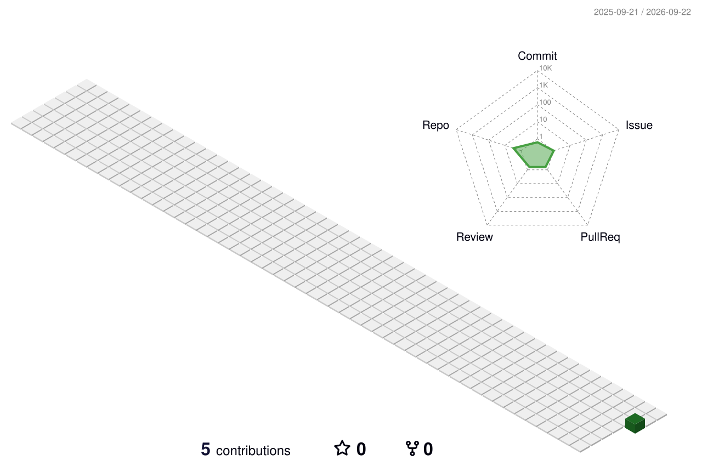

  <a href="https://github.com/ZaneZhang-67/ai-infra-notes">AI Infra Notes</a>
  ·
  <a href="https://github.com/ZaneZhang-67?tab=repositories">Repositories</a>

# Experience

  

# Contribution activity

<picture>
  <source media="(prefers-color-scheme: dark)" srcset="./profile-3d-contrib/profile-night-green.svg">
  <source media="(prefers-color-scheme: light)" srcset="./profile-3d-contrib/profile-green.svg">
  
</picture>

  Updated automatically every day from my GitHub contribution activity.

